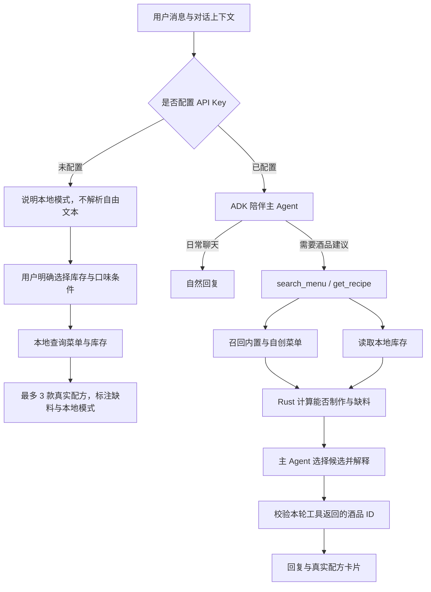

# Mixology · 陪伴式调酒 Agent

个人本地使用的桌面聊天伙伴，当前以 macOS 为验证目标。想聊时陪你聊，需要酒品建议时才通过工具读取酒柜与菜单。推荐同时覆盖内置酒品和你的自创配方，不需要部署云服务器。

## 四个入口

- **聊天**：自然陪伴、按需推荐、配方详情；每轮回复可查看调用链路。
- **酒柜**：直接添加原料、勾选已有材料，浏览内置与自创酒单。同名原料自动复用，新增后可用于自创配方与推荐。库存记录材料种类，暂不计算剩余用量。
- **自定义**：创建、编辑和删除自己的配方；保存后立即可被 Agent 工具召回。
- **设置**：昵称、口味偏好、模型配置，以及最近 100 轮本地 trace。

## 核心工作流



不设置独立意图分类 Agent。菜单工具内部并行读取菜单与库存，缺料由 Rust 计算；模型从检索候选中选择最多 3 款。没有材料也可以展示缺料建议，不自动假定库存齐全。用户随口提到原料不自动修改库存，长期偏好通过设置维护。

SQLite 是结构化菜单知识库，自创配方与内置配方走同一查询入口。当前内置菜单为 **83 款酒、161 种原料**。MVP 不使用向量库，也不依赖云端业务后端。

## 无 API 与失败兜底

- 没有 API Key（包括空密钥文件）：聊天显示本地模式。发送自由文本只返回能力说明，不猜测意图、不自动推荐酒、不调用模型。
- 本地查酒单：选择“用现有材料推荐”“只差一种材料”或“按缺料从少到多”，可叠加酒名/原料关键词、少甜、偏酸和清淡口感。直接复用 Rust 菜单查询，覆盖内置和自创配方；所有条件同时生效，最多返回 3 款。没有结果时保持条件，等待用户调整。
- 本地查询不解析聊天上下文和自由文本偏好。风味按 0–5 筛选，浓烈口感不等于酒精度数；库存只表示材料有无，不代表剩余量充足。
- 网络错误、鉴权失败、90 秒超时或模型输出不合法：保留原消息，提供重试和主动选择本地推荐。不会把失败的自然语言请求静默改成不受约束的推荐；本地查询也不会清空待重试消息或输入草稿。
- 密钥文件读取异常、本地数据库错误继续明确报错。本地查询失败不会伪造成功结果，可保留条件重试。
- 本地回复与推荐保存到同一个 ADK 会话，带 `mode=local` 标记；旧消息默认是 Agent 回复，不需要数据库迁移。补好模型配置后，新消息恢复 ADK 智能陪聊，仍可主动使用本地查询。

本地 trace 成功状态为 `local`（界面显示“本地完成”），记录降级原因、显式查询条件、命中数量和返回酒品 ID；不会出现模型调用事件。错误仍标为 `error`。从失败入口发起查询时，通过来源 trace ID 关联原失败链路；历史链路过期后作为独立本地查询处理。

## 开发

需要 Node.js 20+、Rust stable，以及系统对应的 [Tauri 开发依赖](https://v2.tauri.app/start/prerequisites/)。

```sh
npm ci
npm run tauri:dev
```

若提示找不到 `cargo`，先执行 `source "$HOME/.cargo/env"`，并确保终端启动配置加载了该文件。

只运行 `npm run dev` 是浏览器界面预览，不会伪装为已经接通本地 Agent。实际数据和工具调用需要 Tauri。

在设置中填写支持工具调用的 OpenAI-compatible 模型、基础 API URL 和自己的 API Key，例如 `qwen-plus` 与 `https://dashscope.aliyuncs.com/compatible-mode/v1`。聊天内容、最近的会话和所需候选配方会发送给所选模型服务商。应用没有内置可用密钥。

```sh
npm run build
cargo check --manifest-path src-tauri/Cargo.toml
npm run test:core
npx playwright install chromium
npm test
```

Rust 集成测试通过模拟 LLM 和本地 HTTP/SSE 服务驱动真实 ADK 工具循环，覆盖自创酒入库与召回、可选材料、缺料、非法 ID 拦截、历史持久化、清空上下文及 trace；数据库测试覆盖新库、旧库升级、不兼容版本拒绝和迁移失败回滚。浏览器测试替换 IPC 传输，检查四入口和表单交互；它不替代真实模型质量评估。

## 本地数据

继续使用原桌面目录：`<系统数据目录>/cocktail-app/`。macOS 通常是 `~/Library/Application Support/cocktail-app/`。

| 文件 | 用途 |
| --- | --- |
| `cocktail.db` | 菜单、原料、库存、偏好、模型地址和 trace |
| `cocktail-chat.db` | ADK 持久会话，作为聊天展示与上下文的统一来源 |
| `.model-key` | 本地独立密钥文件，Unix 权限 0600；未作加密 |

新库只创建核心字段；旧库保留自创酒、库存、历史表及附加字段。数据库版本为 2，兼容原始 33 列/扩展 40 列旧库和核心版本 1，拒绝缺少必要字段或来自更新版本的库。旧 `cocktail-memory.db` 不再写入。主题选择留在本机 WebView 的 localStorage。迁移规则、密钥转存及备份说明见 [本地数据边界](docs/local-data.md)。

对话模型使用最近 20 轮已接受消息；完整记录留在本地。每轮先在临时 ADK session 执行，只有通过结果校验后才保存对话，失败可重试。清空聊天会删除实际 session；本地 trace 独立保留，最多 100 轮，不包含完整对话、密钥或完整模型请求。

调试版可设置 `MIXOLOGY_DATA_DIR=/absolute/test-directory` 使用隔离目录，发布版忽略此变量。不要将真实用户数据用于自动测试。

## Trace

每轮有唯一 `traceId`，覆盖本地配置读取、上下文准备、每次模型调用、首响应时间、token 用量（服务商及 ADK 适配器返回时）、工具执行、候选数量、缺料计算、输出校验和会话写入。错误 trace 保留中断阶段；未配置密钥的能力说明和本地推荐同样会留下记录。不会存储模型原始错误体，以避免请求中的敏感字段泄露。Trace 写入失败只记本地日志，不把已保存的成功回复误报为失败。

当前使用按阶段排列的本地事件记录，不需要部署观测服务器；不包含网络重试的独立 span。部分兼容服务的独立 usage 流片段未被当前 ADK 适配器透传，此时不显示 token 统计。

## 代码结构

```text
src/                         四页面、配方卡片、统一 IPC 类型
src-tauri/src/agent.rs        ADK 主 Agent、工具与会话
src-tauri/src/menu.rs         菜单、自创配方事务、库存与缺料
src-tauri/src/local.rs        无模型的显式酒单查询与降级 trace
src-tauri/src/db/             本地数据库与版本化初始化
src-tauri/src/db/legacy.rs    旧用户资料的一次性导入
src-tauri/src/settings.rs     设置与本地密钥
src-tauri/src/trace.rs        本地调用链路
src-tauri/prompts/            陪伴 Agent 提示词
src-tauri/data/               Schema 与带显式列名的菜单数据
adk-rust/                    保留的 ADK 上游源码与许可证
docs/local-data.md           数据库兼容、迁移和备份边界
```

`src-tauri/data/seed.sql` 是唯一内置菜单来源，83 款酒使用 80 张图片，均保留。Tauri 生成目录 `src-tauri/gen/`、Rust 编译缓存、前端构建产物与测试截图不提交；生成的权限 schema 会在构建时重建。

## 本机归档

微信小程序与旧签名文件位于 `../drink-archive-20260917/`。旧产品/设计文档、Android/iOS 工程（含重复菜单）、Workbuddy 记忆和精简前的内置数据位于 `../drink-archive-20260918/`。这些是本机恢复材料，不参与当前构建，也不随 Git 克隆。当前仓库不维护移动端工程。

之前提交过的密钥仍可能存在于 Git 历史，应在服务商处轮换；本次没有重写历史或调用旧密钥。
